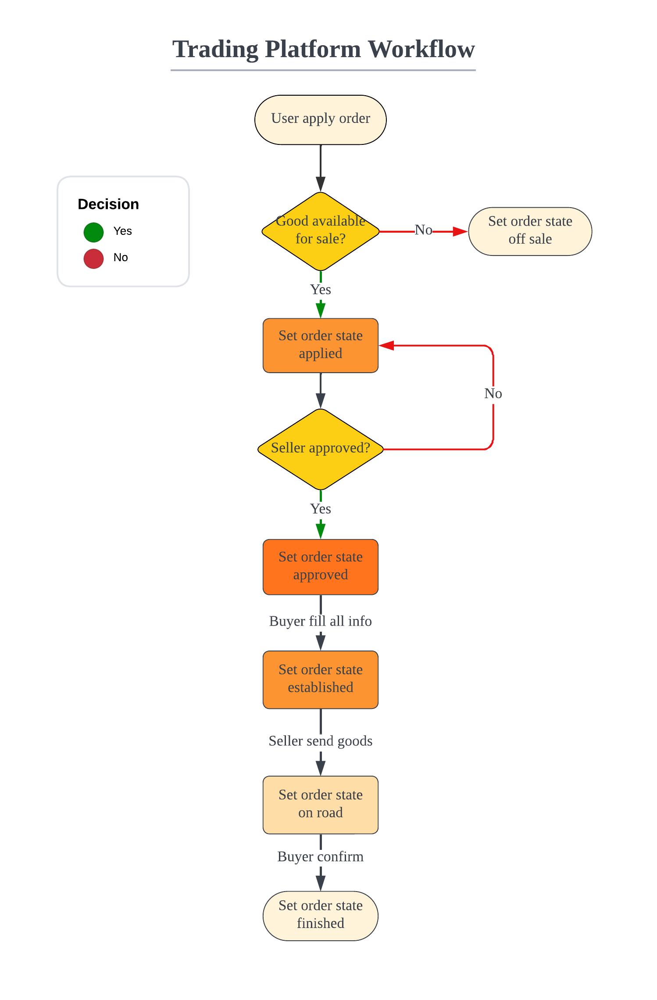

# README

## Project Structure
```shell
.
├── CreateDB.sql  # DDL Statement
├── README.md  # README and Documentation
├── db_api.py  # Database API
├── docs  # Documentation
├── flowchart.png  # System Flowchart
├── main.py  # Main Program
├── requirements.txt  # Required Python packages
├── static  # Static Files
└── templates  # Templates
```

## [Documentation](./docs/build/html/index.html)

### Quick start

**Installation**:

```shell
pip install -r requirements.txt
python main.py
```

**Create database**:

```shell
createdb [database]
psql -u [user] -p < CreateDB.sql
```

**Change the database connection**:

In `db_api.py`, change the `get_db_conn` function to your own database connection.

```python
def get_db_conn():
    """
    功能：获取数据库连接
    注意：替换为自己的数据库信息
    :return: psycopg2.connect
    """
    return psycopg2.connect(database='[database]', # your database name
                            user='[user]', # default is postgres
                            password='[password]', # your password
                            host='127.0.0.1', # or 'localhost'
                            port=5432) # default is 5432
```


**System flowchart**:



### Database API

In `db_api.py`, there are 25 functions divided in 5 parts.   
Refer to the docstring in each function for more details.

- User module
    - `check_username_used`
    - `create_user`
    - `login`
    - `get_user_info`
- Goods module
  - `create_goods`
  - `update_goods`
  - `get_goods_list`
  - `get_goods_list_of_user`
  - `delete_goods`
  - `get_goods_detail`
- Order module
  - `apply_order`
  - `abandon_order`
  - `approve_order`
  - `establish_order`
  - `deliver_goods`
  - `finish_order`
  - `get_order_by_user_and_goods`
  - `get_orders_from_user`
  - `get_orders_to_user`
- Comment module
  - `create_comment`
  - `get_comments`
  - `delete_comment`
- Address module
  - `create_address`
  - `get_address_list`
  - `delete_address`
- Additional functions
  - `get_md5`
  - `get_db_conn`

### Static files

Static files are stored in `static` folder:

- `static/css` CSS files
- `static/fonts` Font files
- `static/images` Image files (user uploaded)
- `static/js` JavaScript files

### Templates

For rendering the web pages:

- `templates/base.html` Base template
- `templates/goods_detail.html` Goods detail page
- `templates/index.html` Index page
- `templates/login.html` Login page
- `templates/manage_address.html` Manage address page
- `templates/manage_goods.html` Manage goods page
- `templates/manage_order.html` Manage order page
- `templates/signup.html` Signup page

## License

This project is licensed under the terms of the **MIT** license.

## Author

**My name**: 熊至潇  
**Student ID**: 2021012356  
**My email**: xiong-zx21@mails.tsinghua.edu.cn  

## Acknowledgements

This is a course project for Database Concepts.  
Thanks to Mr. Wang and the TAs for their painstaking effort.